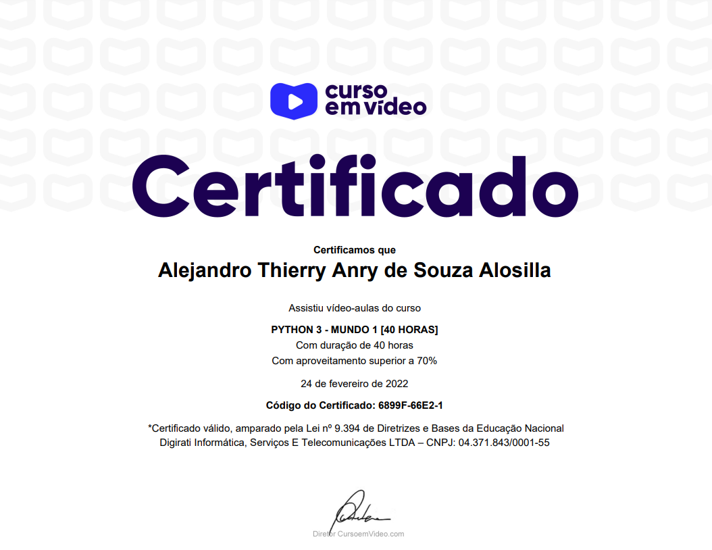

# Exercicios de Python Resolvidos Curso Em Video
 Exercícios do __Mundo 1__ ao __3__ dados no curso da plataforma __*Curso em Vídeo*__ ministrado pelo professor __*Gustavo Guanabara*__.

## Mundo 1
 
1. __Início__
   * __ex001__ - *Deixando tudo pronto*
   * __ex002__ - *Respondendo ao Usuário*
2. __Tipos Primitivos e Saída de Dados__
   * __ex003__ - *Somando dois números*
   * __ex004__ - *Dissecando uma Variável*
3. __Operadores Aritméticos__
   * __ex005__ - *Antecessor e Sucessor*
   * __ex006__ - *Dobro, Triplo, Raiz Quadrada*
   * __ex007__ - *Média Aritmética*
   * __ex008__ - *Conversor de Medidas*
   * __ex009__ - *Tabuada*
   * __ex010__ - *Conversor de Moedas*
   * __ex011__ - *Pintando Parede*
   * __ex012__ - *Calculando Descontos*
   * __ex013__ - *Reajuste Salarial*
   * __ex014__ - *Conversor de Temperaturas*
   * __ex015__ - *Aluguel de Carros*
4. __Utilizando Módulos__
   * __ex016__ - *Quebrando um número*
   * __ex017__ - *Catetos e Hipotenusa*
   * __ex018__ - *Seno, Cosseno e Tangente*
   * __ex019__ - *Sorteando um item na lista*
   * __ex020__ - *Sorteando uma ordem na lista*
   * __ex021__ - *Tocando um MP3*
5. __Manipulando Texto__
   * __ex022__ - *Analisador de Textos*
   * __ex023__ - *Separando dígitos de um número*
   * __ex024__ - *Verificando as primeiras letras de um texto*
   * __ex025__ - *Procurando uma string dentro de outra*
   * __ex026__ - *Primeira e última ocorrência de uma string*
   * __ex027__ - *Primeiro e último nome de uma pessoa*
6. __Condições (Parte 1)__
   * __ex028__ - *Jogo da Adivinhação v.1.0*
   * __ex029__ - *Radar eletrônico*
   * __ex030__ - *Par ou Ímpar*
   * __ex031__ - *Custo da Viagem*
   * __ex032__ - *Ano Bissexto*
   * __ex033__ - *Maior e menor valores*
   * __ex034__ - *Aumentos múltiplos*
   * __ex035__ - *Analisando Triângulo v1.0*

## - [x] Certificado Mundo 1:
